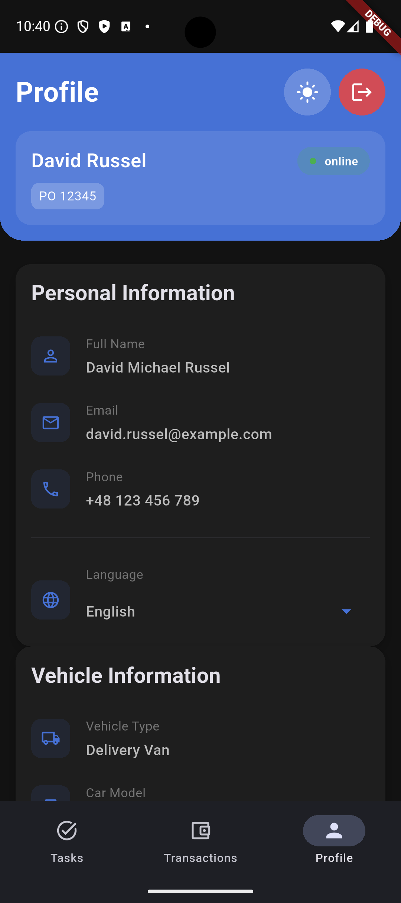
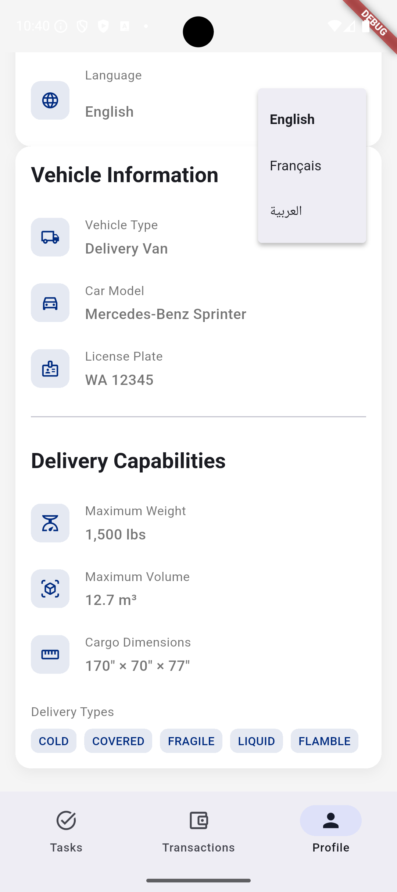
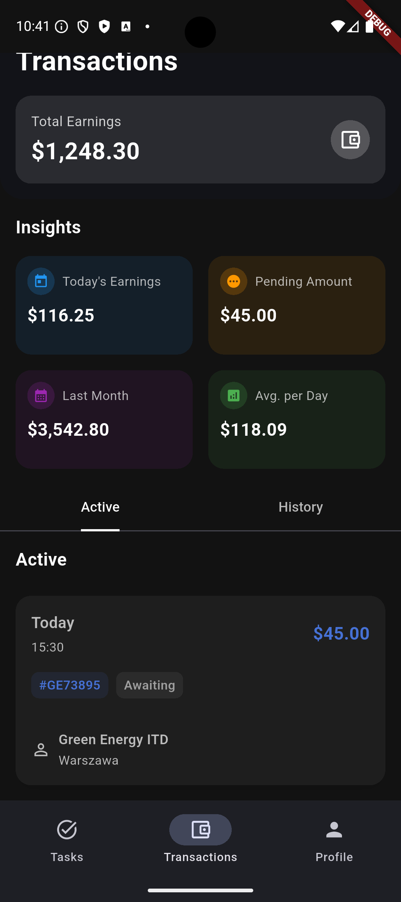
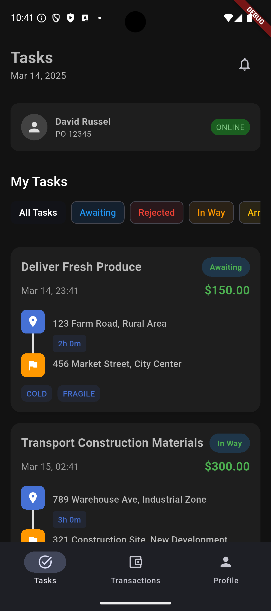
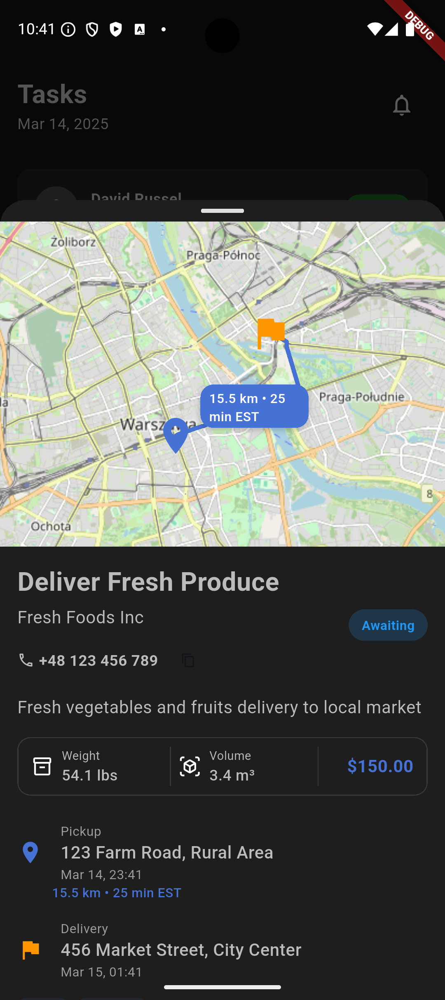
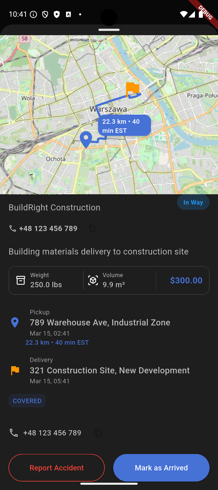

# TruckLoad Driver App

A Flutter-based mobile application that connects truck owners with available loads, making freight delivery management simple and efficient.

## About
This application serves as a platform for truck owners to find and manage load deliveries. Drivers can browse nearby delivery opportunities, check load specifications, and accept jobs that match their vehicle capabilities.

## Key Features

- **Load Discovery**
  - Browse available loads in your area
  - View detailed load requirements (weight, dimensions, type)
  - Check if load contains flammable or hazardous materials
  - See pickup and delivery points on map

- **Load Management**
  - Accept loads that match your truck specifications
  - View complete route information from point A to B
  - Track delivery progress
  - Manage multiple delivery requests

- **Requirements Checking**
  - Detailed load specifications
  - Weight requirements
  - Hazardous material indicators
  - Special handling instructions
  - Required certifications or permits

- **User-Friendly Features**
  - Real-time load notifications
  - Easy-to-use interface
  - Route optimization
  - Load history tracking

## Screenshots

Here are some screenshots of the application:














## Getting Started

### Prerequisites

- Flutter SDK
- Android Studio / VS Code
- Git
- Flutter Map API key (for route visualization)

### Installation

1. Clone the repository:
```bash
git clone [repository-url]
```

2. Navigate to the project directory:
```bash
cd driver
```

3. Install dependencies:
```bash
flutter pub get
```

4. Run the app:
```bash
flutter run
```

## Development Resources

For help getting started with Flutter development, check out these resources:

- [Flutter Documentation](https://docs.flutter.dev/) - Official Flutter documentation
- [Lab: Write your first Flutter app](https://docs.flutter.dev/get-started/codelab)
- [Cookbook: Useful Flutter samples](https://docs.flutter.dev/cookbook)

## Contributing

Contributions are welcome! Please feel free to submit a Pull Request.

## License

This project is licensed under the MIT License - see the LICENSE file for details.
